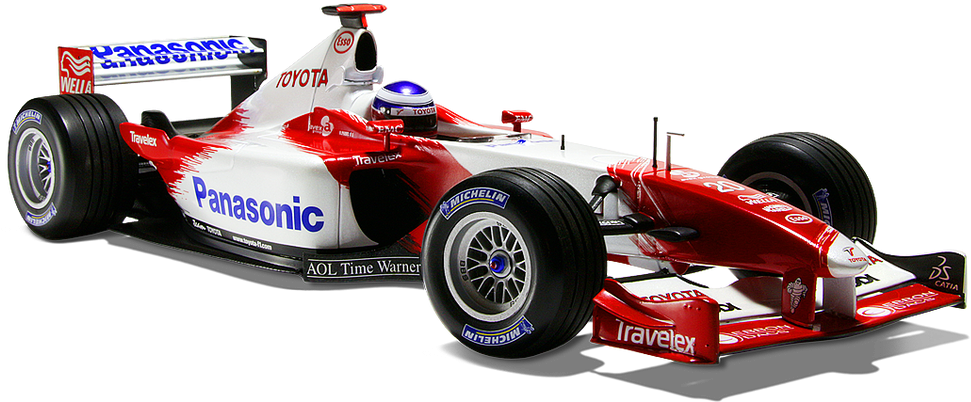

# F1_RaceMetrics

## How I analysis trend / tyre Degradation ? 
### Step 1 Remove outliers: 
- When the laps comes I find the median of it and arrange it in ascending order and then I remove the lap which is +- 3 sec from median lap bec they are outliers bec let's say there is more trafic on the track so the time increases so we remove them.
- Now we have laps which are less than 3 sec from median lap.
### Step 2 Fuel Correction:
- We are not going to skip this because we don't have any data realted to fuel . 
### Step 3 Trend Analysis ( Tyre Degradation )
- We have 2 option in it : 
    - 1st : When we find the clean laps then we compare the first and last lap. 
    - 2nd : We can use regression .
- We are going to use slope method we will find the slope of all the lap if it's a positive that's mean Degradation

